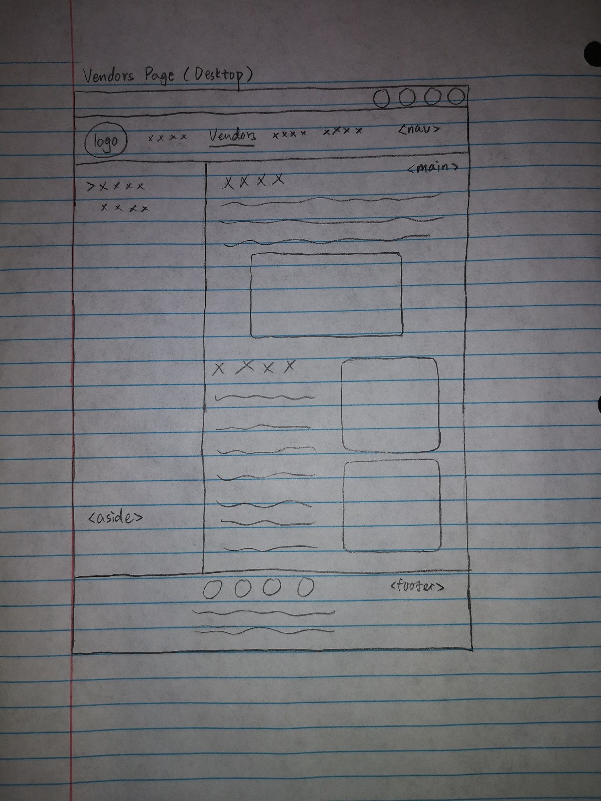
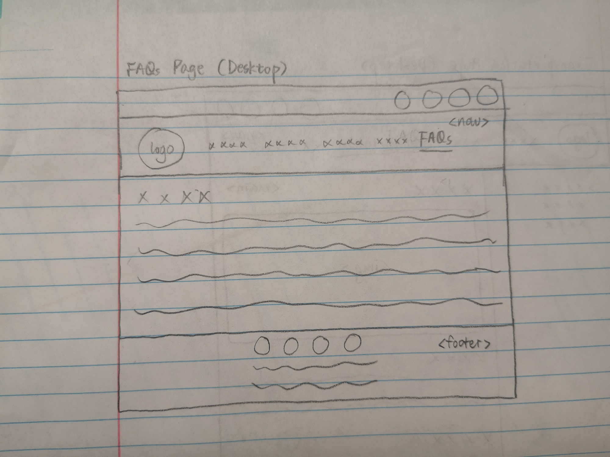

# Project 1: Design Journey

**For each milestone, complete only the sections that are labeled with that milestone.** Refine all sections before the final submission. If you later need to update your plan, **do not delete the original plan, leave it place and append your new plan below the original.** Explain why you are changing your plan. Remember you are graded on your design process. Updating the plan documents your process!

**Replace ALL _TODOs_ with your work.** (There should be no TODOs in the final submission.)

Be clear and concise in your writing. Bullets points are encouraged.

**Everything, including images, must be visible in Markdown Preview.** If it's not visible in Markdown Preview, then we won't grade it. We won't give you partial credit either. Your design journey should be easy to read for the grader; in Markdown Preview the question and answer should have a blank line between them.

## Existing Design (Milestone 1)

**Make the case for your decisions using concepts from class, as well as other design principles, theories, examples, and cases from outside of class (includes the design prerequisite for this course).**

You can use bullet points and lists, or full paragraphs, or a combo, whichever is appropriate. The writing should be solid draft quality.

### Existing Site: The Site (Milestone 1)

> What is your existing site about? Tell us about it.

My existing site is about the Apple Harvest Festival in Ithaca from October 1 to October 3 in 2021. It includes information about time schedule, location, vendors, transportation, and FAQs.

> How and where did you create this site?

I created this site using HTML, CSS, and JavaScript (jQuery) for the project 3 of INFO1300 in the last semester.

> Is this site designed for desktop, mobile devices or both?

This site is designed for both desktop and mobile devices.

### Existing Site: Audience (Milestone 1)

> Who is your _existing_ site's audience?
> Briefly explain who the intended audience(s) is for your website. Be specific and justify why this audience is appropriate for your site. You may not be the audience.

My existing site's audience are people in Ithaca who have never been to the Apple Harvest Festival in Ithaca, but plan to go and want to refer to the information of the past Apple Harvest Festival. This audience is appropriate for my site because they are all new to this event and interested in the information about the past Apple Harvest Festival. My site provides sufficent information for them to achieve their goals.

### Existing Site: Audience Needs (Milestone 1)

> Document your existing site's audience's goals. (These should be informed by user research. Not assumptions.)
> List each goal below. There is no specific number of goals required for this, but you need enough to do the job.
> You may copy these from your previous project. However, I would encourage you to refine them.

Goal 1: Check the exact time duration of the festival and other basic information
- **Design Ideas and Choices** _How will you meet those goals in your design?_
  - Include festival hours
  - Specify the location of the festival
  - Provide information about payment and transportation
- **Rationale & Additional Notes** _Justify your decisions; additional notes._
  - These information should stand out and be easily understood (time and location will be presented on the home page)
  - The site can include a page of FAQs

Goal 2: Know more details about the vendors
- **Design Ideas and Choices** _How will you meet those goals in your design?_
  - An introduction about the vendors
  - A list of some appealing vendors
  - A map of the distribution of vendors
- **Rationale & Additional Notes** _Justify your decisions; additional notes._
  - These information should be accompanied with images that can attract the audiences

Goal 3: Assure their safety under COVID-19
- **Design Ideas and Choices** _How will you meet those goals in your design?_
  - Include safety precautions of COVID-19
- **Rationale & Additional Notes** _Justify your decisions; additional notes._
  - This information can be presented in a Q&A manner

### Existing Site: Design/Sketches (Milestone 1)

> Sketch your existing site. Include these sketches here.
> DO NOT COPY SKETCHES FROM THE ORIGINAL ASSIGNMENT!
> Create new sketches here. This is part of the design process to get you thinking about the strengths/weaknesses of the current design.
> Provide a brief explanation _underneath_ each sketch.

**Home Page (Desktop)**

On top of the home page are a bar for social media links and a navigation bar. Then there is a banner image. Under the banner image, there are texts on the left and images on the right. There is a footer at the bottom of the page.

**Home Page (Mobile)**

Compared with the desktop version, The navigation bar is split into two rows, and the texts and images are displayed in a linear layout. The footer is still at the bottom.

**Vendors Page (Desktop)**

The navigation bar is the same as other pages. There is a sidebar of contents and a main section containing information. In the main section, the two images are on the left of the texts. The footer is the same as other pages.

**Vendors Page (Mobile)**

Compared with the desktop version, the sidebar is moved to the top of the main section and bottom of the navigation bar. The main section displays information in a linear layout.

**Transportation Page (Desktop)**

The layout of transportation page is very similar to that of the vendors page, except that there are three sections in the sidebar. The information in the main section is displayed linearly.

**Transportation Page (Mobile)**

The layout of the mobile version is very similar to that of the mobile vendors page, except that there are three sections in the sidebar.

**FAQs Page (Desktop)**

There is a title followed by the main content. The main content are displayed as an ordered list.

**FAQs Page (Mobile)**

The layout is similar to the desktop version, but the width is shorter.

## Refined Design (Milestone 2)

### Refined Design: Persona (Milestone 2)

> Use the goals your identified above from user research to develop a persona of your site's audience.
> Your persona must have a name and a "depiction". This can be a photo of a face or a drawing, etc.
> There is no required format for the persona.
> You may type out the persona below with bullet points or include an image of the persona. Just make sure it's easy to read the persona when previewing markdown.

Persona's Name: Matt

- Matt's photo:

- Matt's status:
A Cornell sophomore student.

- Factors that influence Matt's behavior:
  - It is Covid time currently.
  - He is busy on weekends.
  - He lives far away from the festival site.
  - He has a limited budget.

- Matt's goals & Obstacles & Desires
  - Goal: to attend Apple Harvest Festival
  - Obstacles: it's difficult to stay safe during the pandemic; he may need to take public transportation; he has to select a time from his tight schedule.
  - Desire: to eat and buy something meaningful on the festival; to get a lift to the festival.

### Refined Design: Content Organization/Navigation (Milestone 2)

> Identify the content that is necessary for your persona. **Refer to the persona by name.**
> List the content here. Label the content as "(new)" if it's new to the existing site.
> **Don't forget to include the form.**

- Time of the festival
- Location of the festival
- An image of the festival location
- How to attend the festival by taking public transportation
- Map of the festival
- Parking information
- Safety precautions of Covid 19
- Information about interesting vendors
- Images of some vendors
- Information about payment
- Information about parking charge
- (new) Schedule of the festival events
- The best time to attend the festival

> Organize the content for the audience and identify possible pages for the content using card sorting.
> Document your card sorting by taking a photo and including it here.
> You are **required** to show the alternative organization you considered. (1 card sort is not enough)

#### Iteration 1

#### Iteration 2

> Explain your thought process behind the card sorting. **Refer to the persona by name in your explanation.**

#### Iteration 1

I divided the content into 5 categories. From left to right, the first column contains the most important information for Matt: time and location of the festival, because he needs to arrange his schedule and plans his trip. The second column only contains the schedule of the festival events, because they are very detailed information for Matt to decide the period that he wants to attend. The third column contains information about transportation to the event, including the map, bus info, and parking info. The fourth column contains info about vendors, which Matt can use to plan which vendor he wants to visit. The last column contains info that are less important and more random, including safety precautions, payment methods, parking charges, and suggested best time. These info are required by Matt.

#### Iteration 2

In this iteration, I divided the content into 5 categories. From left to right, the first column contains information related to time, including festival time, event schedule, and suggested best time. The second column contains info related to payment, including payment methods and other charges. The third column contains info related to transportation, including location, map, bus info, and parking info. The fourth column contains info related to info about vendors. The last column contains info about covid 19. However, I reject this content organization for the following reasons:

- Although the categories are more clear in this structure, the most important info for Matt are distributed in different pages. This will make it inconvenient for him to check the festival at the first time.
- The info about Covid-19 doesn't have an appropriate category, so I can only leave it as a single page. This page will contain so little info, which is not very user-friendly.
- Sometimes when users see the categories such as "time" and "payment", they may become confused.

Therefore, I chose the first iteration as my final content organization.

> Lastly, list the pages that resulted from your final card sort (i.e. your site's navigation) and content for each page.

- Home
  - Location of the festival
  - Time of the festival
  - An image of the festival location
- Vendors
  - Images of some vendors
  - Info about interesting vendors
- Transportation
  - Map of the festival
  - How to attend the festival by public transportation
  - Parking info
- Schedule
  - Schedule of the festival events
- FAQs
  - Safety precautions of Covid-19
  - Info about parking charge
  - Info about payment
  - The best time to attend the festival

### Refined Design: Design (Milestone 2)

> Refine the design of your site to meet the goals of your users using your persona.
> Include sketches of each page of the refined design.
> Provide a brief explanation _underneath_ each sketch.
> Document your _entire_ design process. **Show your preliminary sketches and your final sketches.** **We want to see iteration!** You must have multiple iterations of each page for full credit.
> **Refer to your persona by name in each explanation.**

#### Iteration 1

The navigation bar and footer include a new page link of entertainment schedule.

The navigation bar and footer include a new page link of entertainment schedule.

The navigation bar and footer include a new page link of entertainment schedule.

The schedule page link in the navigation bar is placed between transportation page link and faqs page link. The other styles and layout should be the same as other pages. There is a title of "Entertainment Schedule" on the main section. Below are main content.

The navigation bar and footer include a new page link of entertainment schedule.

#### Iteration 2

The navigation bar and footer include a new page link of entertainment schedule.

The navigation bar and footer include a new page link of entertainment schedule.

The navigation bar and footer include a new page link of entertainment schedule.

The schedule page link in the navigation bar is placed between vendors page link and transportation page link. The other styles should be the same as other pages. There is a title of "Entertainment Schedule" on the main section. Below are main content. The main content are divided into two columns: the left column is Saturday schedule and the right column is Sunday schedule.

The navigation bar and footer include a new page link of entertainment schedule.

#### Final

I finally decided to use the designs in iteration 2 for the following reasons:
- The entertainment schedule is more related to the home page and vendors page, so I should put this link after these two links and before other pages (transportation and faqs pages).
- The entertainment schedule doesn't have very long paragraphs, and the structures of Saturday and Sunday schedule are very similar and square. Therefore, separating them into two parallel columns will use the space more efficiently.

### Partial Plan (Milestone 2)

> Using your refined sketches, plan your site's partials.
> You may describe each partial or sketch it. It's up to you!

#### Partial 1: the contact icons bar

This partial is the area where the 4 social media icons are placed. This bar remains the same in all the pages.

#### Partial 2: the navigation bar

This partial is the navigation bar, including the logo and five links. It remains the same in all the pages.

#### Partial 3: the footer

This partial is the bottom area where the social media icons, page links, and copyright information are placed. The footer remains the same in all the pages.

## Complete & Polished Website (Final Submission)

### Routing (Final Submission)

> Plan your dynamic HTTP routing.
> List each route and the PHP file for each route.

| Route | PHP File                                 |
| ---------------------- | ----------------------- |
| /                      | pages/home.php          |
| /about-vendors         | pages/vendors.php       |
| /event-schedule        | pages/schedule.php      |
| /transport-to-festival | pages/transportation.php|
| /faqs                  | pages/faqs.php          |

### Audience (Final Submission)

> Tell us how your final site meets the needs of the audience. Be specific here. Tell us how you tailored your design, content, etc. to make your website usable for your persona. **Refer to the persona by name.**

In terms of the content, my website meets Matt's needs by providing information from the five aspects: general/most important information (home page), vendors' information, detailed event schedule, methods of transportation, and other faqs. To be specific, Matt wants to know the time and location in order to attend the festival, and he can acquire this information from the home page; Matt has a tight schedule, so he can use the event schedule to plan and arrange his time; Matt wants to know information about how to travelling from his home to the festival, and he can learn about the public transportation and parking information from the transportation page; Matt is worried about the covid-19, and he can find the related precautions in the faqs; Matt desires to eat and buy meaningful things, he can achieve this by exploring the vendors on the vendor page before attending the festival; finally, Matt has a limited budget, and the faqs page provides info about all possible payments.

In terms of the design, my website employs a layout with which Matt is familiar with: a typical navigation bar on the top of every page, a typical footer on the bottom of every page, and the main content in between the navigation bar and the footer. The design of dropdown menus, sidebars, and navigation bar in the footer will make it more easier for Matt to navigate and search for information. The website selects readable fonts and font styles, accompanied with several colorful images that can visually attract Matt and give him a direct sense of the festival. Additionally, the color theme of the website echoes with the theme of apple festival, which is pleasant to Matt.

In terms of the content organization, my website clearly categorizes the info into five sections: the home page where the most important information is located, the vendors page, the event schedule page, the transportation page, and the faqs page. The names and urls of these pages are all straightforward, so Matt will know where to go when he is searching for any information.

Therefore, my final site meets the needs of Matt, helps him to browse more efficiently, and provides a friendly user experience for him.

### Accessibility Audit

> Tell us what issues you discovered during your accessibility audit.
> What do you do to improve the accessibility of your site?

I discovered that there were two links (one on the transportation page, the other on the faqs page) named "here", which is not accessible to the users. When I was submitting milestone 2, I discovered that the two links also had a contrast error: the color of the links is too similar to the background color.

Before the logo is loaded when opening a new page, the placeholder is the alt text "Home". I think this text is misleading, expecially when it is next to the "Home" link in the navigation bar. When users access my website by a screen reader, this will lead to a low accessibility.

To improve the accessibility, firstly I should rename the two links. I plan to name them based on the actual page that they link to. Secondly, I should revise the color of the two links. I did this when I submitted the milestone 2. I changed their color to a darker brown color so they can contrast with the light background color. Thirdly, I should revise the alternative text of the logo. I plan to change it into "Festival logo", because this makes more sense.

### Additional Design Justifications (Final Submission)

> If you feel like you haven’t fully explained your design choices in the final submission, or you want to explain some functions in your site (e.g., if you feel like you make a special design choice which might not meet the final requirement), you can use the additional design justifications to justify your design choices. Remember, this is place for you to justify your design choices which you haven’t covered in the design journey. You don’t need to fill out this section if you think all design choices have been well explained in the design journey.

Since I used jump links in my website (in the dropdown menus and sidebars), when I was designing the routing, I decided to keep the character "#" in the urls to indicate the jump links. For example:

`/about-vendors#intro`

This url specifies "the introduction part of the about-vendors page".
Although it is a convention to use hyphens to separate words, I think that "#" in this situation will make more sense, and it is not a very special character that is hard for users to type. Therefore, I kept this design choice.

### Self-Reflection (Final Submission)

> Reflect on what you learned during this assignment. How have you improved from 1300? What things did you have trouble with?

I have learned to design a persona for my audience. The persona helps me empathize with my audiences and better understand their needs.

I have also learned how to program a website using php, how to reduce redundant code by implementing partials, and how to organize my files according to the convention. All of these skills lead me to coding my first dynamic website.

Lastly, I have learned how to design in the back-end. It is not about the front-end design in INFO1300 anymore; I also need to care about the urls and web accessibility.

I had trouble with initiating the router and revising the links in my code, because I was confused by the jump links. However, I solved the problem finally.

> Take some time here to reflect on how much you've learned since you started this class. It's often easy to ignore our own progress. Take a moment and think about your accomplishments in this class. Hopefully you'll recognize that you've accomplished a lot and that you should be very proud of those accomplishments!

I made a progress in designing the persona for my audience and coding a basic dynamic website. I tried to understand my code and website structure more deeply when I was implementing the partials and the router. Also, the accessibility audit makes me think about more details in terms of user experience, such as the screen reader, color contrast, and the names of any hyperlinks. I did a good job in refining and turning my project from last semester into a dynamic and more user-friendly website.

### Grading: Mobile or Desktop (Final Submission)

> When we grade your final site, should we grade this with a mobile screen size or a desktop screen size?

You can grade this with either screen size.

### Grading: Partials (Final Submission)

> Clearly list each partial file and where you used it.

- footer.php: I used it at the bottom of every web page. This partial is the footer.
- header.php: I used it at the top of every web page. This is the bar of four social media icons.
- nav.php: I used it as the navigation bar in every web page. This partial includes all the page links.

> Which partials have customization? Explain how the customization looks in the browser.

- nav.php has customization. It underlines the current page in the navigation bar using the yellow color. There is no underline on the not found page.

### Grading: Open the Design Journey in Markdown Preview

> Preview your design journey in VS Code. Please verify that this document is easy to read/grade.
> - All images must be visible.
> - All images must be oriented the correct way.
> - There should be a blank line between the question prompt and your answer.
> Is your design journey easy to read?

Yes.
